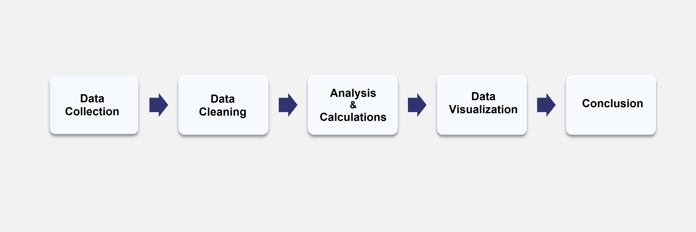
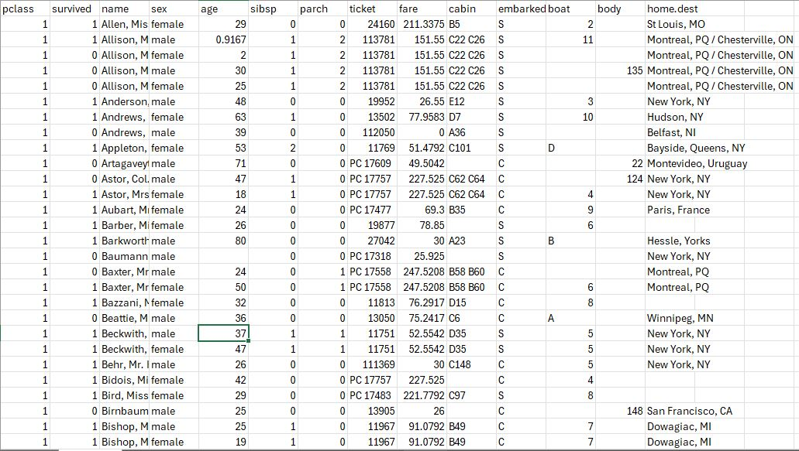
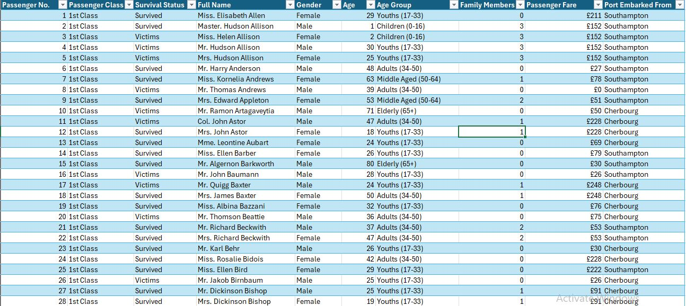
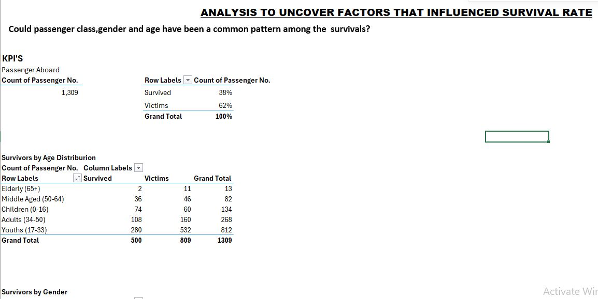
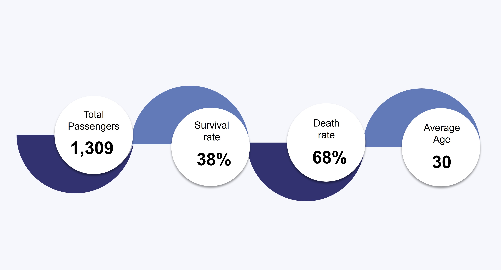
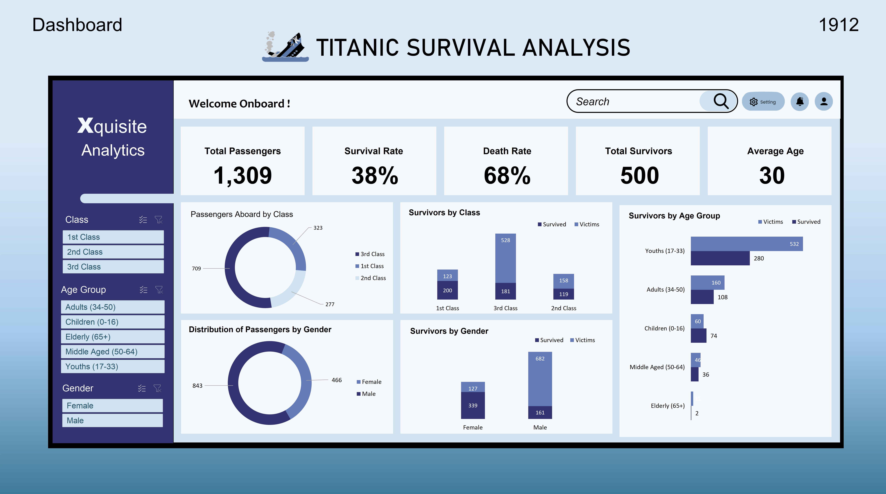
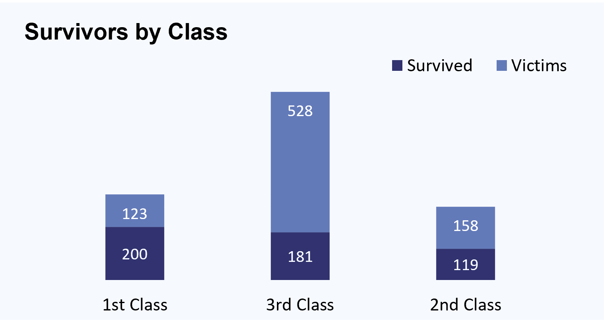
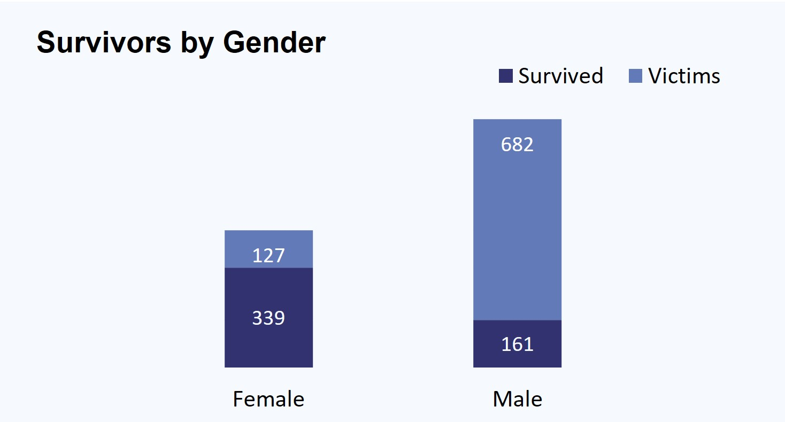
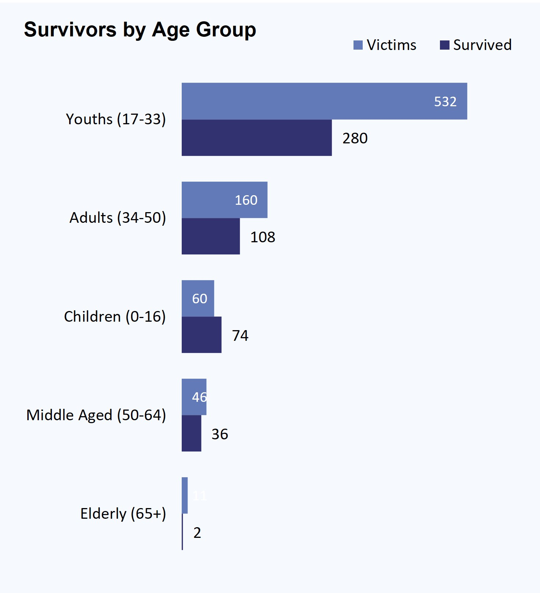

# Titanic Survival Analysis 
#### " A Microsoft Excel analysis to uncover factors that influenced Titanic survival rates"

---
## Introduction 
On April 15, 1912,approximately 113 years ago the RMS Titanic sank during its maiden voyage from Southampton,England to Newyork after colliding with an iceberg in the North Atlantic Ocean.
This historical disaster claimed the lives of many, and remains the deadliest maritime tragedies in history.

This project revisits the tragedic event of 1912 through data analysis to uncover common patterns among survivors.

---
## Problem Statement 
Despite the reported 2,224 passengers she was carrying, survival chances aboard the Titanic were not evenly distributed. Apparently, When the distress call was made factors such as P assenger class, gender, and age appeared to have played a significant role in determining who lived and who perished. 

The Understanding of these disparities is crucial for uncovering the social and structural dynamics that influenced survival during this tragedy. Hence, the aim of this analysis is to investigate how facrors such as passengers class, gender and age on influence survival rate. 

---
## Project Workflow 

---
## Data Source 

The dataset used for this project is a well-known resource in the data space and is available on Kaggle:  
[Titanic Dataset on Kaggle](https://www.kaggle.com/datasets/brendan45774/test-file)  

It contains information on **1,309 passengers** out of the 2,224 on board the Titanic, excluding crew members.  
This provides a suitable sample size for meaningful analysis of survival patterns across different passenger groups.
___

## Raw Data 

The downloaded dataset was imported into Microsoft Excel and opened in its raw form as shown below with 14 columns of raw passenger information requiring cleaning for further analysis.

The information in each column above has the following features:

1. **pclass** — Passenger Class (1 = 1st; 2 = 2nd; = 3rd)  
2. **survived** — Survival (0 = No; 1 = Yes)  
3. **name** — Name  
4. **sex** — Sex  ( M or F)
5. **age** — Age  
6. **sibsp** — Number of Siblings/Spouses Aboard  
7. **parch** — Number of Parents/Children Aboard  
8. **ticket** — Ticket Number  
9. **fare** — Passenger Fare  
10. **cabin** — Cabin  
11. **embarked** — Port of Embarkation (C = Cherbourg; Q = Queenstown; S = Southampton)  
12. **boat** — Lifeboat (if survived)  
13. **body** — Body number (if did not survive and body was recovered)  
14. **home_dest** — Destination

---
## Data Cleaning Process 

The Titanic dataset required several cleaning steps to prepare it for analysis. Below is the structured **step-by-step process**:  

1. **Initial Inspection**  
   - Applied filters on each column to understand the dataset and identify issues.  

2. **Column Renaming & Replacements**  
   - Renamed **Passenger Class** column → *1st, 2nd, 3rd class*.  
   - Replaced **Survival Status** codes → *1 = Survived, 0 = Victim*.  

3. **Name Standardization**  
   - Split the *Name* column into *Title, First Name, Last Name* (using *Text-to-Columns*).  
   - Reconstructed the full name using the *CONCAT/CONCATENATE* function.  

4. **Gender Standardization**  
   - Converted all values in the *Sex* column to **Proper Case** (e.g., *male → Male*, *female → Female*).  

5. **Handling Missing Ages**  
   - Found **263 missing ages** out of 1,309 records (~20%).  
   - Since missing values were < 30%, imputed them using the **Median Age = 28**.  
   - Median was chosen as it is resistant to outliers. 
   - created the age- group column,to categories the ages of passengers using the IF function to assign each passenger to an age group.
   - (0 - 16= Children,17 - 33 = Youths,34 - 50 = Adults,51 -64 = Middle Aged,65+ = Elderlys)

6. **Family Size Feature Creation**  
   - Created a new **Family Members** column by adding:  
     `sibsp + parch`.  

7. **Ticket Column**  
   - Dropped the *Ticket Number* column as it was not relevant for analysis.  

8. **Fare Column**  
   - Rounded fares to the nearest whole number and added currency (euros).  
   - Note: Historical reference suggests **3rd class tickets cost ~3–8 euros** in 1912.  
   - Passengers with **0 fare** were assumed to have boarded illegally or under special cases.  

9. **Cabin Column**  
   - Dropped the *Cabin* column since **1,014 cells (~77%)** were empty.  

10. **Boat & Body Columns**  
    - Deleted both columns since missing values were > 70% and not relevant to the analysis.  

11. **Embarked Column**  
    - Renamed column to **Port Embarked From**.  
    - Replaced codes with full names:  
      - **S → Southampton**  
      - **C → Cherbourg**  
      - **Q → Queenstown**

---

## Cleaned Data 

After general cleaning the dataset became **structured, consistent, and ready for further analysis.** to draw insight and identify patterns 

---

## Analysis and Calculations

Pivot tables and charts where used for analysis and calculations of KPI's and other metrics like

   - Survivors by Passenger Class

   - Survivors by Gender

   - Survivors by Age group 

--
## KPI's 

### Interpretation  

- A total of **1,309 passengers** were onboard the Titanic.  
- The **survival rate was 38%**, meaning just over one-third of passengers survived.  
- The **death rate was 68%**, indicating that more than two-thirds of passengers perished, highlighting the tragedy’s scale.  
- The **average passenger age was 30 years**, suggesting that most onboard were relatively young adults.  

- ### The KPI's reflect the severity of the disaster, with a low survival ratio as compared to the death ratio and predominantly young passengers on board.

---
## Data Visualization (Dashboard) 

### Exploratory Dashboard

---
## Insights 

### 1. Survivors by Class  
- **First Class:** Best survival outcomes (**200 survived vs 123 perished**) due to proximity to lifeboats and quicker access to the deck.  
- **Second Class:** Mixed results (**119 survived vs 158 perished**) reflecting their intermediate position onboard.  
- **Third Class:** Most disadvantaged (**528 deaths vs 181 survivors**). Barriers, lower-deck locations, and class divisions critically reduced their chances.  
---

### 2. Survivors by Gender  
- **Females:** Significantly higher survival rate (**339 survived vs 127 perished**) due to the "women and children first" policy.  
- **Males:** Disproportionately affected (**682 deaths vs 161 survivors**), making up the majority of victims.  

---

### 3. Survivors by Age Group  
- **Youths (17–33 years):** Largest group onboard but also the highest number of deaths (**532 victims vs 280 survivors**). Being young did not guarantee survival, likely due to limited access to lifeboats.  
- **Children (0–16 years):** Higher survival chance (**74 survived vs 60 perished**), suggesting they were prioritized during evacuation.  
- **Elderly (65+ years):** Most vulnerable, with only **2 survivors** compared to **11 deaths**, reflecting physical limitations in the chaos.

 ## Summary   
The Titanic disaster starkly revealed how **age, gender, and social class shaped survival chances**.  

- Women and children were prioritized, especially in higher classes.  
- Men, particularly young men in third class, bore the greatest losses.  
- First-class passengers benefitted from privilege and proximity, while third-class passengers suffered from both **physical barriers** and **social inequalities**.  

> This tragedy is not just statistics — it reflects the harsh reality of structural inequality in a life-and-death situation.  

---
## Conclusion
---
## Limitation 
---
## About 

